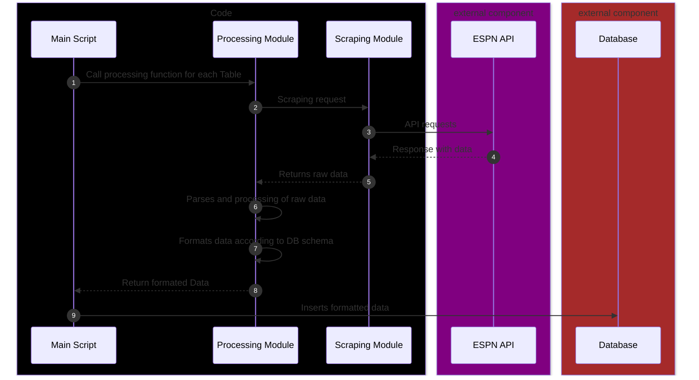

# ESPN Rugby Data Scraper and ETL Pipeline

This Python project is designed to create a comprehensive rugby database (stored locally with MariaDB) by extracting, transforming, and loading (ETL), data from ESPN's hidden API.

The project aims to retrieve complete match statistics for each league (e.g. Top 14) and season, as well as player statistics per season and per match. This extensive data collection is specifically tailored to support analysis and research by sports data scientists.

* **Key focus areas include**:
  * Leagues data by season
  * Teams data
  * Stadiums data
  * Player data
  * Standings data by season
  * Match datas and statistics by league and season
  * player datas and statistics for each match

For a detailed breakdown of the data structure, including tables, fields, and relationships, please refer to the dedicated [markdown document](database/README.md). This document provides comprehensive information on how the data is organized and can be utilized for various analytical purposes.

For a comprehensive overview of all statistical fields collected for standings, matches and players, please refer to our [Data Dictionary](dictionary/README.md).


## Prerequisites

- MariaDB installed and running on your system
- Git (optional, for cloning the repository)

## Setup

1. **Clone the repository (if you haven't already)**:
   ```
   git clone https://github.com/your-username/rugby-db-scraper.git
   cd rugby-db-scraper
   ```

2. **Set up the Python environment**:

   Choose one of the following options:

   *A. Using a virtual environment (recommended):*
      ```
      python -m venv rugby_scraper_venv
      ```
      
      Activate the virtual environment:
      - On Windows:
        ```
        rugby_scraper_venv\Scripts\activate
        ```
      - On macOS and Linux:
        ```
        source rugby_scraper_venv/bin/activate
        ```

   *B. Or, if you prefer not to use a virtual environment, you can skip this step.*

3. **Install the required packages**:
   ```
   pip install -r requirements.txt
   ```

   This will install all the necessary dependencies for the project.
   > **📢Note :** <br>
   >  If you're not using a virtual environment, the packages will be installed globally on your system. Be aware that this might affect other Python projects you have.

3. **Set up the database**:
   
   
   Navigate to the database setup script directory:
   ```
   cd project/database
   ```
   The script in this folder will create the necessary database and tables. Make sure to have your MariaDB/MySQL root password ready.

   You'll find the database schema in the [SQL script file](database/create_tables.sql) and complementary information on db architecture in the [documentation file](database/README.md).

   **Before running the setup script, you need to update the configuration variables:**
   * For Windows:
  
      Edit the [`setup_db.bat`](database/setup_db.bat) file and update the following variables:
      ```batch
      set "DB_NAME=your_database_name"
      set "DB_USER=your_database_user"
      set "DB_PASS=your_database_password"
      set "MariaDB_PASS=your_mariadb_root_password"
      set "MariaDB_PATH=path_to_your_mariadb_bin_folder"
      set "MariaDB_SCRIPT_FILE=create_tables.sql"
      ```
   * For Linux/macOS:

      Edit the [`setup_db.sh`](database/setup_db.sh) file and update the following variables:
      ```bash
      DB_NAME="your_database_name"
      DB_USER="your_database_user"
      DB_PASS="your_database_password"
      MariaDB_PASS="your_mariadb_root_password"
      MariaDB_SCRIPT_FILE="create_tables.sql"
      ```

   **After updating the variables, run the appropriate setup script:**

   * For Windows:
      ```
      setup_db.bat
      ```

   * For Linux/macOS:
      ```
      chmod +x setup_db.sh
      ./setup_db.sh
      ```

> **🚧 WARNING**: <br>
> For Linux/macOS, the script was generated by Claude Sonnet 3.5 from the Windows batch script. It has not been tested on Linux and macOS systems.


## Usage

1. Ensure your Conda environment is activated:
   ```
   conda activate rugby-scraper
   ```

2. Run the main script:
   ```
   python main.py
   ```

3. Follow the prompts to enter the following information into your terminal:
   - *Database connection details :*
     ```
      ------ Please enter your database connection information ------
      Database: rugby_db
      User: admin
      password: 
     ``` 
   - *League to scrape :*
      ```
      0 - British and Irish Lions Tour
      1 - International Test Match
      2 - Rugby World Cup
      3 - Summer Nations Series
      4 - Six Nations
      ...
      45 - Olympic Men's 7s
      46 - Olympic Women's Rugby Sevens
      47 - Women's Rugby World Cup
      48 - Major League Rugby
      49 - Americas Rugby Championship
      Select a league index : 9
      ```
   - *Season or specific matchday to scrape :*
      ```
      Do you want to scrape (1) the last gameday of the season or (2) a specific year? (1/2):
      ```
     - *If season, select the year :*
         ```
         0 - 2025
         1 - 2024
         2 - 2023
         3 - 2022
         ...
         15 - 2010
         16 - 2009
         17 - 2008
         Select year index : 
         ```

4. The script will then proceed to scrape the requested data and store it in the database.
   > **📈 PERFORMANCE AND EXECUTION TIME**: <br>
   > Scraping an entire season of professional rugby union (15s) league data is a substantial task. 
   > Here's what you can expect:
   >     
   > - <u>Volume</u>: Between 10,000 to 12,000 API requests for a typical season (e.g., Top 14)
   > - <u>Content</u>: Comprehensive data including league info, team details, match statistics, and player data
   > - <u>Duration</u>: Approximately 45 minutes for a complete season scrape

5. Execution Results:
   - For successful execution, you will see an output similar to this:
   
   - If an error occurs, you might see an output like this:
   

These images provide a visual reference for what to expect upon successful completion or in case of an error.

## Troubleshooting

- If you encounter database connection issues, ensure that your MariaDB/MySQL server is running and that the credentials in the setup script are correct.
- For Python-related errors, make sure all dependencies are correctly installed.

## Logging System

The project implements a comprehensive logging system to track the scraping process and data insertion.

### Real-time Console Output
- API requests are displayed in the terminal in real-time.
- Users can copy and paste URLs to inspect source data in their browser.

### Warnings
The console displays warnings for missing data.

*Handling of missing data depends on its criticality:*
  * For critical data (primary keys or unique keys):
    - No data related to the corresponding table is scraped or stored.
    - Data with foreign keys referencing the missing critical data are also skipped.
  * For non-critical missing data:
    - The scraping process continues.
    - Missing values are replaced with NULL in the database.

This approach balances data integrity with maximum data collection. Users should review these warnings to understand potential data gaps or inconsistencies.

### Log Files
- A log file is generated in the `log` folder for each script execution.
- Contains detailed execution history, including:
  * API requests
  * Infos
  * Warnings
  * Errors
  * Database insertion statistics

## Limitations and Data Integrity

The ESPN database, while comprehensive, has several limitations that users should be aware of:

- <u>Data inconsistencies</u>: Information may sometimes be incomplete, incorrect, or inconsistent.
- <u>Duplicate entries</u>: Some tables might contain duplicate data.
- <u>Missing information</u>: Certain data points may be absent entirely.

Given these challenges, verifying data integrity is crucial before conducting any data science analysis. We strongly recommend cross-referencing the scraped data with other sources when possible. 

Our scraping process includes various checks and generates warnings for potential issues. However, it cannot guarantee 100% data accuracy. Always approach the scraped data with a critical eye and be prepared to clean and validate it before use. Remember, the quality of your analysis is only as good as the data you're working with.

## Contributing

This project is in its early stages and has been primarily tested on a single local machine. As such, we welcome all forms of contribution, especially:

- Bug reports
- Suggestions for code efficiency improvements
- Identification of bad practices
- General feedback and ideas for enhancement

If you'd like to contribute:

1. Feel free to open an issue describing the bug or improvement you've identified.
2. For more detailed discussions or if you prefer direct communication, you can reach out via email at hans95.bourgeois@gmail.com.
3. Pull requests are also welcome if you'd like to contribute code directly.

Your input is valuable in making this project more robust and efficient. Thank you for your interest in contributing!


# Overview of the ETL Process



The diagram above presents a general view of our ETL (Extract, Transform, Load) process for each table in our database. It illustrates how our script handles the different stages of data collection, processing, and storage.

## Key Components

The process involves several components, represented by different colors:

* **Internal Components** (in black):
   * `Main Script`
   * `Processing Module`
   * `Scraping Module`
* **External Components**:
   * `ESPN API` (in purple)
   * `Database` (in brown)

## Workflow

1. **Extraction**
   * The `main script` initiates the process for each table.
   * The `processing module` calls the `scraping module`.
   * The `scraping module` interacts with the ESPN API to retrieve raw data.

2. **Transformation**
   * The `processing module` parses and processes the raw data.
   * The data is then formatted to match the `database` schema.

3. **Loading**
   * The `main script` receives the formatted data.
   * This data is finally inserted into the `database`.

>**📢 Note**: <br>
 This diagram represents a simplified view of the process. In reality, additional steps may be necessary, such as error handling or additional API requests for supplementary data.

