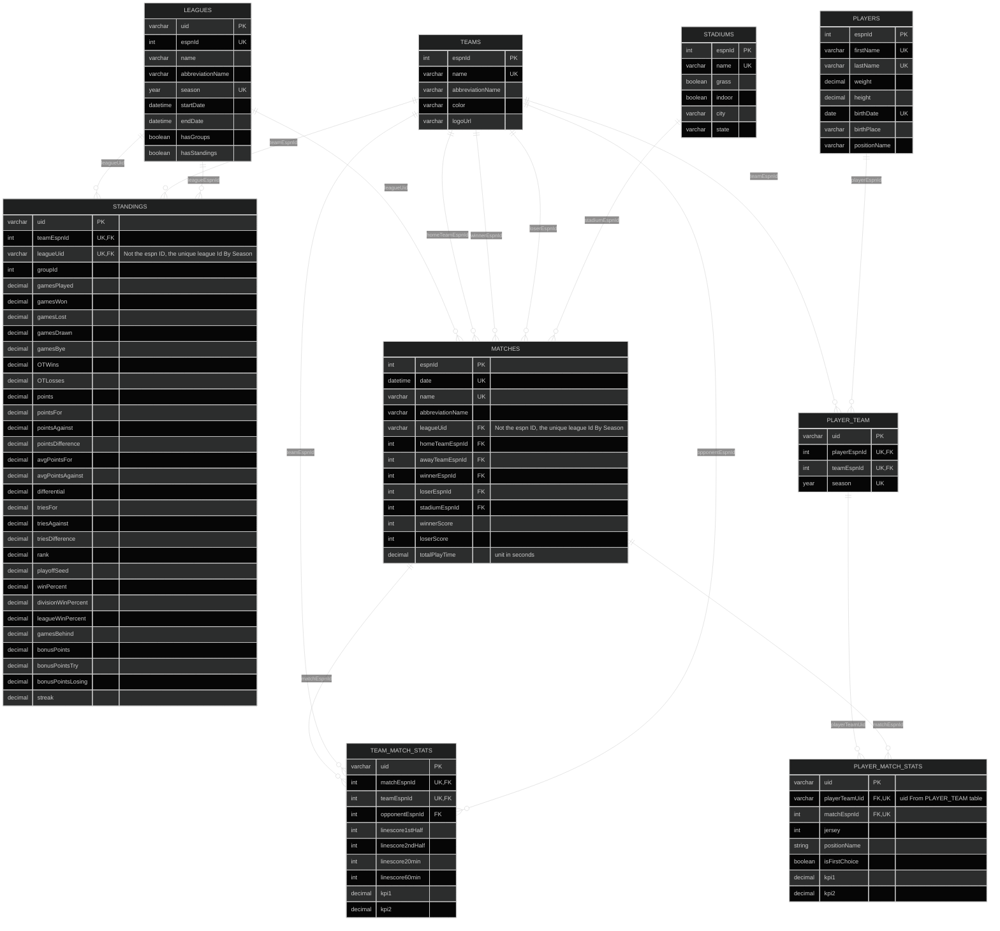
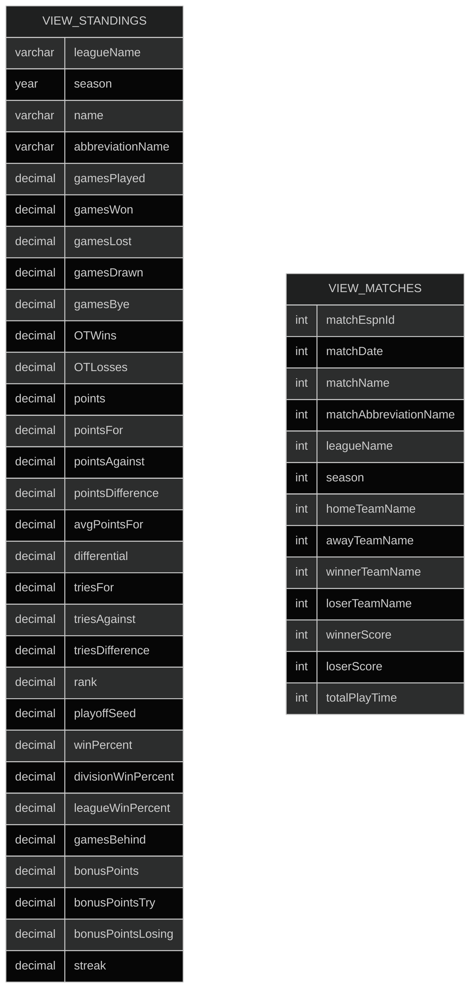

# Entity relation diagram of data base

# Tables architecture



## Summary of Architectural Choices


> 📢**INTRODUCTION** <BR>
> The database has been designed to store and manage team and player statistics related to matches within various sports competitions.
> This is my first database, and I have tried to follow good relational modeling practices to ensure data maintainability.
> Please share your feedback and suggestions to improve/optimize the database architecture.

### Normalization
Normalization is an essential process in database design that aims to structure data in a way that minimizes redundancy and improves data integrity. It involves decomposing tables into smaller, well-structured entities, each representing a unique concept.
In this rugby database, normalization has been strictly applied to all tables (unless I'm mistaken).

**Advantages:**
1. Reduces data redundancy between tables
2. Ensures data consistency in most cases
3. Facilitates database maintenance and scalability

**Disadvantages:**
1. May require more joins in queries, which can impact performance

### Use of Primary Keys (PK), Foreign Keys (FK), and Unique Keys (UK)
Each table has a unique identifier (`PRIMARY KEY`) for each record. When the table construction requires a combination of identifiers from two different ESPN tables, a table-specific unique identifier (`UID`) is generated using the `generate_deterministic_uid()` function.
The `generate_deterministic_uid()` function takes a list of unique values (values of `UNIQUE KEYS`), concatenates them in a consistent order, and then generates a 16-character hexadecimal UID using a SHA256 hash. This UID is deterministic, meaning it will always be the same for the same input values.
The rationale behind using deterministic UIDs is to simplify the handling of foreign key relationships, as explained previously.
In addition to the unique identifiers (PK or UID), the uniqueness of the records (rows) for each entity is also guaranteed by the use of unique keys (`UNIQUE`) on one or more columns. This dual mechanism of using both unique identifiers and unique key combinations ensures the integrity and consistency of the data.
The relationships between tables are established using foreign keys (`FOREIGN KEY`).

**Advantages:**
1. Guarantees the uniqueness of records in a deterministic way using UIDs
2. Ensures referential integrity
3. Facilitates joins between tables
4. Avoids issues related to the use of auto-incremented identifiers
5. Simplifies the data insertion logic by eliminating the need to retrieve auto-generated primary keys

> 🚧 **WARNING :** 🚧 <br>
    Initially, I had defined a `UNIQUE` constraint on the `name` field of the `Stadium` table in my database to guarantee the uniqueness of stadium entries. <br><br>
    However, I realized that this constraint was not applied in the ESPN database, from which I retrieve the data.<br>
    As a result, the ESPN database contains duplicate stadium entries, but with different unique `espnId` values. When I try to insert these duplicate stadiums into my database, MariaDB raises an error or ignores the insertion (depending on the insert function, `insert()` and `insert_ignore()` respectively), because the name field no longer contains the `UNIQUE` constraint. 
    Furthermore, in tables that have a foreign key referencing the `Stadium` table, errors occur because duplicate `espnId` values are not present in the `Stadiums` table, leading to referential integrity problems. <br><br>
    **To solve this problem I modified my database schema and removed the `UNIQUE` constraint on the `name` field of my `Stadiums` table so that the table accepts duplicate stadiums.**


### Relationships and Junction Tables
In a relational database, the relationships between tables are essential for modeling the complexity of the real world. These relationships allow linking data between different tables, ensuring the integrity and consistency of the stored information. Junction tables, on the other hand, are used to solve many-to-many relationships, allowing a flexible association between entities without data duplication.

In our rugby database, we primarily use three types of relationships:

1. One-to-Many
2. Many-to-One
3. Many-to-Many

#### **One-to-Many Relationship**

This relationship exists when an entity (from the parent table) can be associated with multiple instances of another entity (child table), but each instance of the latter is associated with only one instance of the former.

*Example*: The relationship between `LEAGUES` and `MATCHES`.
A league can have multiple matches, but each match belongs to only one league. For example, the "Top 14" league can have hundreds of matches during a season, but a specific match like "Toulouse vs Clermont" belongs only to the "Top 14" league.

```
                    MATCHES (many)      
LEAGUES (one)       +-----------+
+---------+         | MatchId   |
| uid     |<--------| leagueUid |
| name    |         | date      |
| season  |         | name      |
| abbrev  |         | ...       |
+---------+         +-----------+
                    
```

#### **Many-to-One Relationship**

This is the reciprocal relationship of One-to-Many. It exists when multiple instances of an entity are associated with a single instance of another entity.

*Example*: The relationship between `MATCHES` and `LEAGUES`.
While we have seen that the relationship from `LEAGUES` to `MATCHES` is One-to-Many (a league can have multiple matches), the inverse relationship, from `MATCHES` to `LEAGUES`, is Many-to-One. Multiple matches belong to a single league.

```
MATCHES (many)      
+----------+         LEAGUES (one)
| MatchId  |         +-----------+
| leagueUid|-------->| uid       |
| date     |         | name      |
| name     |         | season    |
| ...      |         | abbrev    |
+----------+         +-----------+

```

#### **Many-to-Many Relationship**

This relationship exists when multiple instances of an entity can be associated with multiple instances of another entity. It generally requires a junction table.

*Example*: The relationship between `PLAYERS` and `TEAMS`, resolved by the `PLAYER_TEAM` table.
A player can play for multiple teams during his career, and a team for a specific season has obviously multiple players. Take the example of Finn Russell: he has played for Glasgow Warriors, Racing 92, and now Bath. Each of these teams has had and has many other players. The `PLAYER_TEAM` table allows tracing these associations over time, with an entry for each player-team-season combination.

```
                    +---------------+
+----------+        |  PLAYER_TEAM  |       
| PLAYERS  |        +---------------+       +------------+
+----------+        | playerTeamUid |       |  TEAMS     |
| espnId   |<-------| playerEspnId  |       +------------+
| firstName|        | teamEspnId    |------>| espnId     |
| lastName |        | season        |       | name       |
+----------+        +-------------- +       | abbrev     |
                                            +------------+
```

### Use of Views for Statistics
The architecture of our rugby database uses views (`VIEWs`) to optimize data analysis. These views incorporate joins to create complete and directly usable data sets. This approach has several advantages:

1. **Data Aggregation**:
    The views combine statistics by categories (offensive, defensive, disciplinary) with contextual information from other tables (matches, teams, players).

    *Example*: `VIEW_TEAM_MATCH_OFFENSIVE_STATS` includes the offensive statistics as well as details about the team, the opponent, and the match.

2. **Simplified Access**:
   Each view acts as a single entry point, reducing the need for complex joins in queries.

3. **Maintenance Ease**:
   The centralization of the join logic in the view definitions simplifies updates. Structural changes or the addition of new metrics can be handled by adjusting the view definitions, ensuring data consistency without impacting existing queries.


>  ❓ **Why are all match and player statistics grouped in the same table ?** <br>
During the data extraction (scraping) process, all these statistics are available together. Storing them in a single table simplifies the insertion process and reduces the complexity of the ETL (Extract, Transform, Load) pipeline.


# Views

## Standings & Matches



## team-match statistics clustered by key aspects of play

```mermaid
%%{init: {'theme': 'dark',
"themeCSS": [
    ".er.entityBox { fill: blue} ",
    "[id*=-V] .er.entityBox {fill: green}"
    ]
}}%%
erDiagram
    VIEW_TEAM_MATCH_OFFENSIVE_STATS {
        int uid "informations"
        varchar leagueName
        year season
        varchar matchName
        varchar matchAbbreviationName
        datetime matchDate
        varchar teamName
        varchar teamAbbreviationName
        varchar teamColor
        varchar teamLogoUrl
        varchar opponentTeamName
        int totalPlayTime
        bool isWinner
        bool isHome
        decimal teamScore
        decimal opponentTeamScore
        decimal passes "stats"
        decimal runs
        decimal metres
        decimal attackingKicks
        decimal offload
        decimal cleanBreaks
        decimal defendersBeaten
        decimal breakAssist
        decimal carriesMetres
        decimal carriesCrossedGainLine
        decimal carriesNotMadeGainLine
        decimal carriesSupport
        decimal averageGain
        decimal dummyHalfMetres
        decimal hitUps
        decimal hitUpMetres
        decimal runFromDummyHalf
        decimal tackleBusts
        decimal attackingEventsZoneA
        decimal attackingEventsZoneB
        decimal attackingEventsZoneC
        decimal attackingEventsZoneD
        decimal completeSets
        decimal incompleteSet
    }

    VIEW_TEAM_MATCH_DEFENSIVE_STATS {
        int uid "informations"
        varchar leagueName
        year season
        varchar matchName
        varchar matchAbbreviationName
        datetime matchDate
        varchar teamName
        varchar teamAbbreviationName
        varchar teamColor
        varchar teamLogoUrl
        varchar opponentTeamName
        int totalPlayTime
        bool isWinner
        bool isHome
        decimal teamScore
        decimal opponentTeamScore
        decimal tackles "stats"
        decimal tackleSuccess
        decimal missedTackles
        decimal markerTackles
    }

    VIEW_TEAM_MATCH_SCORING_STATS {
        int uid "informations"
        varchar leagueName
        year season
        varchar matchName
        varchar matchAbbreviationName
        datetime matchDate
        varchar teamName
        varchar teamAbbreviationName
        varchar teamColor
        varchar teamLogoUrl
        varchar opponentTeamName
        int totalPlayTime
        bool isWinner
        bool isHome
        decimal teamScore
        decimal opponentTeamScore
        decimal points "stats"
        decimal tries
        decimal penaltyTries
        decimal tryAssists
        decimal tryBonusPoints
        decimal losingBonusPoints
        decimal conversionGoals
        decimal dropGoalsConverted
        decimal dropGoalMissed
        decimal goals
        decimal missedConversionGoals
        decimal missedGoals
        decimal penaltyGoals
        decimal missedPenaltyGoals
    }


    VIEW_TEAM_MATCH_DISCIPLINE_STATS {
        int uid "informations"
        varchar leagueName
        year season
        varchar matchName
        varchar matchAbbreviationName
        datetime matchDate
        varchar teamName
        varchar teamAbbreviationName
        varchar teamColor
        varchar teamLogoUrl
        varchar opponentTeamName
        int totalPlayTime
        bool isWinner
        bool isHome
        decimal teamScore "stats"
        decimal opponentTeamScore
        decimal freeKickConcededAtLineout
        decimal freeKickConcededAtScrum
        decimal freeKickConcededInGeneralPlay
        decimal freeKickConcededInRuckOrMaul
        decimal freeKickConceded
        decimal penaltiesConceded
        decimal penaltyConcededCollapsingMaul
        decimal penaltyConcededCollapsingOffense
        decimal penaltyConcededCollapsing
        decimal penaltyConcededDelibKnockOn
        decimal penaltyConcededDissent
        decimal penaltyConcededEarlyTackle
        decimal penaltyConcededFoulPlay
        decimal penaltyConcededHandlingInRuck
        decimal penaltyConcededHighTackle
        decimal penaltyConcededKillingRuck
        decimal penaltyConcededLineoutOffence
        decimal penaltyConcededObstruction
        decimal penaltyConcededOffside
        decimal penaltyConcededOppHalf
        decimal penaltyConcededOther
        decimal penaltyConcededOwnHalf
        decimal penaltyConcededScrumOffence
        decimal penaltyConcededStamping
        decimal penaltyConcededWrongSide
        decimal totalFreeKicksConceded
        decimal onReport
        decimal redCards
        decimal yellowCards
    }

    VIEW_TEAM_MATCH_KICKING_STATS {
        int uid "informations"
        varchar leagueName
        year season
        varchar matchName
        varchar matchAbbreviationName
        datetime matchDate
        varchar teamName
        varchar teamAbbreviationName
        varchar teamColor
        varchar teamLogoUrl
        varchar opponentTeamName
        int totalPlayTime
        bool isWinner
        bool isHome
        decimal kicks "stats"
        decimal kickFromHandMetres
        decimal kicksFromHand
        decimal kickChargedDown
        decimal tryKicks
        decimal kickTryScored
        decimal kickOutOfPlay
        decimal kickInTouch
        decimal kickOppnCollection
        decimal kickPossessionLost
        decimal kickPossessionRetained
        decimal kickTouchInGoal
        decimal kickPenaltyBad
        decimal kickPenaltyGood
        decimal totalKicks
        decimal totalKicksSucceeded
        decimal kickPercentSuccess
        decimal pcKickPercent
        decimal kickSuccess
        decimal kickReturns
        decimal kickReturnMetres
        decimal fortyTwenty
        decimal penaltyKickForTouchMetres
    }

    VIEW_TEAM_MATCH_POSSESSION_CONTROL_STATS {
        int uid "informations"
        varchar leagueName
        year season
        varchar matchName
        varchar matchAbbreviationName
        datetime matchDate
        varchar teamName
        varchar teamAbbreviationName
        varchar teamColor
        varchar teamLogoUrl
        varchar opponentTeamName
        int totalPlayTime
        bool isWinner
        bool isHome
        decimal ballPossessionLast10Mins "stats"
        decimal pcPossessionFirst
        decimal pcPossessionSecond
        decimal pcTerritoryFirst
        decimal pcTerritorySecond
        decimal possession
        decimal territory
        decimal territoryLast10Mins
        decimal collectionFailed
        decimal collectionFromKick
        decimal collectionInterception
        decimal collectionLooseBall
        decimal collectionSuccess
        decimal retainedKicks
        decimal trueRetainedKicks
        decimal restart22m
        decimal restartErrorNotTen
        decimal restartErrorOutOfPlay
        decimal restartHalfway
        decimal restartOppError
        decimal restartOppPlayer
        decimal restartOwnPlayer
        decimal restartsLost
        decimal restartsSuccess
        decimal restartsWon
        decimal handlingError
        decimal phaseNumber
        decimal playTheBall
        decimal turnoverWon
        decimal turnoversConceded
        decimal turnoverOppHalf
        decimal turnoverOwnHalf
        decimal turnoverLostInRuckOrMaul
        decimal turnoverKnockOn
        decimal turnoverForwardPass
        decimal turnoverCarriedInTouch
        decimal turnoverCarriedOver
        decimal turnoverKickError
        decimal turnoverBadPass
        decimal ballWonZoneA
        decimal ballWonZoneB
        decimal ballWonZoneC
        decimal ballWonZoneD
    }

    VIEW_TEAM_MATCH_SET_PIECES_STATS {
        int uid "informations"
        varchar leagueName
        year season
        varchar matchName
        varchar matchAbbreviationName
        datetime matchDate
        varchar teamName
        varchar teamAbbreviationName
        varchar teamColor
        varchar teamLogoUrl
        varchar opponentTeamName
        int totalPlayTime
        bool isWinner
        bool isHome
        decimal scrumsWonFreeKick "stats"
        decimal scrumsWonOutright
        decimal scrumsWonPenalty
        decimal scrumsWonPenaltyTry
        decimal scrumsWonPushoverTry
        decimal scrumsLostFreeKick
        decimal scrumsLostOutright
        decimal scrumsLostPenalty
        decimal scrumsLostReversed
        decimal scrumsLost
        decimal scrumsReset
        decimal scrumsSuccess
        decimal scrumsTotal
        decimal scrumsWon
        decimal lineoutsToOppPlayer
        decimal lineoutsWon
        decimal lineoutSuccess
        decimal lineoutsLost
        decimal lineoutsInfringeOpp
        decimal lineoutsInfringeOwn
        decimal lineoutThrowWonClean
        decimal lineoutThrowWonFreeKick
        decimal lineoutThrowWonPenalty
        decimal lineoutThrowWonTap
        decimal lineoutThrowLostFreeKick
        decimal lineoutThrowLostHandlingError
        decimal lineoutThrowLostNotStraight
        decimal lineoutThrowLostOutright
        decimal lineoutThrowLostPenalty
        decimal lineoutsToOwnPlayer
        decimal lineoutThrowNotStraight
        decimal lineoutWonOwnThrow
        decimal lineoutWonSteal
        decimal totalLineouts
        decimal setPieceWon
    }

    VIEW_TEAM_MATCH_RUCK_AND_MAUL_STATS {
        int uid "informations"
        varchar leagueName
        year season
        varchar matchName
        varchar matchAbbreviationName
        datetime matchDate
        varchar teamName
        varchar teamAbbreviationName
        varchar teamColor
        varchar teamLogoUrl
        varchar opponentTeamName
        int totalPlayTime
        bool isWinner
        bool isHome
        decimal rucksLost
        decimal rucksWon
        decimal rucksTotal
        decimal ruckSuccess
        decimal maulsWon
        decimal maulsLost
        decimal maulsTotal
        decimal maulsWonOutright
        decimal maulsLostOutright
        decimal maulsWonPenalty
        decimal maulsLostTurnover
        decimal maulsWonPenaltyTry
        decimal maulsWonTry
        decimal maulingMetres
    }

    VIEW_TEAM_MATCH_GENERAL_STATS {
        int uid "informations"
        varchar leagueName
        year season
        varchar matchName
        varchar matchAbbreviationName
        datetime matchDate
        varchar teamName
        varchar teamAbbreviationName
        varchar teamColor
        varchar teamLogoUrl
        varchar opponentTeamName
        int totalPlayTime
        bool isWinner
        bool isHome
        decimal matches "stats"
        decimal won
        decimal lost
        decimal drawn
        decimal numberOfTeams
        decimal startingMatches
        decimal replacementMatches
    }

```



## player-match statistics clustered by key aspects of play

```mermaid
%%{init: {'theme': 'dark',
"themeCSS": [
    ".er.entityBox { fill: blue} ",
    "[id*=-V] .er.entityBox {fill: green}"
    ]
}}%%
erDiagram
    VIEW_PLAYER_MATCH_OFFENSIVE_STATS {
        int uid "informations"
        varchar firstName
        varchar lastName
        decimal weight
        decimal height
        varchar teamName
        varchar teamAbbreviationName
        varchar teamColor
        varchar teamLogoUrl
        varchar matchName
        datetime matchDate
        int teamScore
        int opponentTeamScore
        bool isHome
        varchar leagueName
        year season
        varchar opponentTeamName
        decimal passes "stats"
        decimal runs
        decimal metres
        decimal attackingKicks
        decimal offload
        decimal cleanBreaks
        decimal defendersBeaten
        decimal breakAssist
        decimal carriesMetres
        decimal gainLine
        decimal carriesCrossedGainLine
        decimal carriesNotMadeGainLine
        decimal carriesSupport
        decimal averageGain
        decimal dummyHalfMetres
        decimal hitUps
        decimal hitUpMetres
        decimal runFromDummyHalf
        decimal tackleBusts
    }

    VIEW_PLAYER_MATCH_DEFENSIVE_STATS {
        int uid "informations"
        varchar firstName
        varchar lastName
        decimal weight
        decimal height
        varchar teamName
        varchar teamAbbreviationName
        varchar teamColor
        varchar teamLogoUrl
        varchar matchName
        datetime matchDate
        int teamScore
        int opponentTeamScore
        bool isHome
        varchar leagueName
        year season
        varchar opponentTeamName
        decimal tackles "stats"
        decimal tackleSuccess
        decimal missedTackles
        decimal markerTackles
    }

    VIEW_PLAYER_MATCH_SCORING_STATS {
        int uid "informations"
        varchar firstName
        varchar lastName
        decimal weight
        decimal height
        varchar teamName
        varchar teamAbbreviationName
        varchar teamColor
        varchar teamLogoUrl
        varchar matchName
        datetime matchDate
        int teamScore
        int opponentTeamScore
        bool isHome
        varchar leagueName
        year season
        varchar opponentTeamName
        decimal points "stats"
        decimal tries
        decimal tryAssists
        decimal tryBonusPoints
        decimal losingBonusPoints
        decimal conversionGoals
        decimal dropGoalsConverted
        decimal dropGoalMissed
        decimal goals
        decimal missedConversionGoals
        decimal missedGoals
        decimal penaltyGoals
        decimal missedPenaltyGoals
        decimal goalsFromMark
    }

    VIEW_PLAYER_MATCH_DISCIPLINE_STATS {
        int uid "informations"
        varchar firstName
        varchar lastName
        decimal weight
        decimal height
        varchar teamName
        varchar teamAbbreviationName
        varchar teamColor
        varchar teamLogoUrl
        varchar matchName
        datetime matchDate
        int teamScore
        int opponentTeamScore
        bool isHome
        varchar leagueName
        year season
        varchar opponentTeamName
        decimal freeKickConcededAtLineout "stats"
        decimal freeKickConcededAtScrum
        decimal freeKickConcededInGeneralPlay
        decimal freeKickConcededInRuckOrMaul
        decimal penaltiesConceded
        decimal penaltyConcededCollapsingMaul
        decimal penaltyConcededCollapsingOffense
        decimal penaltyConcededDelibKnockOn
        decimal penaltyConcededDissent
        decimal penaltyConcededEarlyTackle
        decimal penaltyConcededFoulPlay
        decimal penaltyConcededHandlingInRuck
        decimal penaltyConcededHighTackle
        decimal penaltyConcededKillingRuck
        decimal penaltyConcededLineoutOffence
        decimal penaltyConcededObstruction
        decimal penaltyConcededOffside
        decimal penaltyConcededOppHalf
        decimal penaltyConcededOther
        decimal penaltyConcededOwnHalf
        decimal penaltyConcededScrumOffence
        decimal penaltyConcededStamping
        decimal penaltyConcededWrongSide
        decimal totalFreeKicksConceded
        decimal onReport
        decimal redCards
        decimal yellowCards
    }

    VIEW_PLAYER_MATCH_KICKING_STATS {
        int uid "informations"
        varchar firstName
        varchar lastName
        decimal weight
        decimal height
        varchar teamName
        varchar teamAbbreviationName
        varchar teamColor
        varchar teamLogoUrl
        varchar matchName
        datetime matchDate
        int teamScore
        int opponentTeamScore
        bool isHome
        varchar leagueName
        year season
        varchar opponentTeamName
        decimal kicks "stats"
        decimal kickMetres
        decimal kickFromHandMetres
        decimal kicksFromHand
        decimal kickChargedDown
        decimal tryKicks
        decimal kickTryScored
        decimal kickOutOfPlay
        decimal kickInField
        decimal kickInTouch
        decimal kickOppnCollection
        decimal kickPossessionLost
        decimal kickPossessionRetained
        decimal kickTouchInGoal
        decimal kickPenaltyBad
        decimal kickPenaltyGood
        decimal kickPercentSuccess
        decimal pcKickPercent
        decimal kickReturns
        decimal kickReturnMetres
        decimal fortyTwenty
        decimal penaltyKickForTouchMetres
    }

    VIEW_PLAYER_MATCH_POSSESSION_CONTROL_STATS {
        int uid "informations"
        varchar firstName
        varchar lastName
        decimal weight
        decimal height
        varchar teamName
        varchar teamAbbreviationName
        varchar teamColor
        varchar teamLogoUrl
        varchar matchName
        datetime matchDate
        int teamScore
        int opponentTeamScore
        bool isHome
        varchar leagueName
        year season
        varchar opponentTeamName
        decimal collectionFailed "stats"
        decimal collectionFromKick
        decimal collectionInterception
        decimal collectionLooseBall
        decimal collectionSuccess
        decimal retainedKicks
        decimal trueRetainedKicks
        decimal restart22m
        decimal restartErrorNotTen
        decimal restartErrorOutOfPlay
        decimal restartHalfway
        decimal restartOppError
        decimal restartOppPlayer
        decimal restartOwnPlayer
        decimal restartsLost
        decimal restartsSuccess
        decimal restartsWon
        decimal handlingError
        decimal droppedCatch
        decimal badPasses
        decimal ballOutOfPlay
        decimal pickup
        decimal catchFromKick
        decimal turnoverWon
        decimal turnoversConceded
        decimal turnoverOppHalf
        decimal turnoverOwnHalf
        decimal turnoverLostInRuckOrMaul
        decimal turnoverKnockOn
        decimal turnoverForwardPass
        decimal turnoverCarriedInTouch
        decimal turnoverCarriedOver
        decimal turnoverKickError
        decimal turnoverBadPass
    }

    VIEW_PLAYER_MATCH_SET_PIECES_STATS {
        int uid "informations"
        varchar firstName
        varchar lastName
        decimal weight
        decimal height
        varchar teamName
        varchar teamAbbreviationName
        varchar teamColor
        varchar teamLogoUrl
        varchar matchName
        datetime matchDate
        int teamScore
        int opponentTeamScore
        bool isHome
        varchar leagueName
        year season
        varchar opponentTeamName
        decimal scrumsWonFreeKick "stats"
        decimal scrumsWonOutright
        decimal scrumsWonPenalty
        decimal scrumsWonPenaltyTry
        decimal scrumsWonPushoverTry
        decimal scrumsLostFreeKick
        decimal scrumsLostOutright
        decimal scrumsLostPenalty
        decimal scrumsLostReversed
        decimal lineoutsWon
        decimal lineoutSuccess
        decimal lineoutsLost
        decimal lineoutsInfringeOpp
        decimal lineoutThrowWonClean
        decimal lineoutThrowWonFreeKick
        decimal lineoutThrowWonPenalty
        decimal lineoutThrowWonTap
        decimal lineoutThrowLostFreeKick
        decimal lineoutThrowLostHandlingError
        decimal lineoutThrowLostNotStraight
        decimal lineoutThrowLostOutright
        decimal lineoutThrowLostPenalty
        decimal lineoutsToOwnPlayer
        decimal lineoutNonStraight
        decimal lineoutWonOppThrow
        decimal lineoutWonOwnThrow
        decimal lineoutWonSteal
        decimal totalLineouts
    }

    VIEW_PLAYER_MATCH_RUCK_AND_MAUL_STATS {
        int uid "informations"
        varchar firstName
        varchar lastName
        decimal weight
        decimal height
        varchar teamName
        varchar teamAbbreviationName
        varchar teamColor
        varchar teamLogoUrl
        varchar matchName
        datetime matchDate
        int teamScore
        int opponentTeamScore
        bool isHome
        varchar leagueName
        year season
        varchar opponentTeamName
        decimal rucksLost "stats"
        decimal rucksWon
        decimal maulsWon
        decimal maulsLost
        decimal maulsWonOutright
        decimal maulsLostOutright
        decimal maulsWonPenalty
        decimal maulsLostTurnover
        decimal maulsWonPenaltyTry
        decimal maulsWonTry
    }

    VIEW_PLAYER_MATCH_GENERAL_STATS {
        int uid "informations"
        varchar firstName
        varchar lastName
        decimal weight
        decimal height
        varchar teamName
        varchar teamAbbreviationName
        varchar teamColor
        varchar teamLogoUrl
        varchar matchName
        datetime matchDate
        int teamScore
        int opponentTeamScore
        bool isHome
        varchar leagueName
        year season
        varchar opponentTeamName
        decimal matches "stats"
        decimal won
        decimal lost
        decimal drawn
        decimal numberOfTeams
        decimal startingMatches
        decimal replacementMatches
        decimal mintuesPlayedBeforeFirstHalfExtra
        decimal minutesPlayedBeforeFirstHalf
        decimal minutesPlayedBeforePenaltyShootOut
        decimal minutesPlayedBeforeSecondHalfExtra
        decimal minutesPlayedBeforeSecondHalf
        decimal minutesPlayedFirstHalf
        decimal minutesPlayedFirstHalfExtra
        decimal minutesPlayedSecondHalf
        decimal minutesPlayedSecondHalfExtra
        decimal minutesPlayedTotal
    }
```

